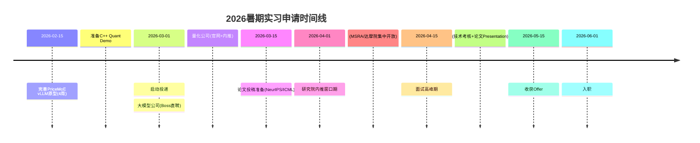

基于你的背景（HKUST IEDA PhD，运筹优化+ML系统交叉，多篇MoE推理/随机控制/匹配市场工作论文），以下是为**研究院**、**大模型公司**、**量化公司**三类岗位定制的实习申请策略、投递流程与能力补齐方案。

---

## 一、岗位匹配度分析与定位策略

| 目标类型 | 核心契合点 | 差异化优势 | 风险点 |
|---------|-----------|-----------|--------|
| **研究院**<br>(MSRA/华为诺亚/阿里达摩院) | OR顶刊(submitted)+ML系统交叉<br>MoE Routing理论创新 | 用排队论/流体极限解决LLM基础设施问题，符合"AI for Science"趋势 | 缺顶会(NEURIPS/ICML)发表记录 |
| **大模型公司**<br>(月之暗面/智谱/Minimax/DeepSeek) | PriceMoE/Fluid-Affinity直接对应<br>EP/Prefill优化痛点 | 有vLLM集成方案(文档显示熟悉代码结构)，非纯理论 | 缺大规模集群(>512卡)实测经验 |
| **量化公司**<br>(Citadel/幻方/九坤/灵均) | 随机控制+排队网络+市场微观结构<br>(Airline Cargo/Ride-Hailing) | 强数学建模能力(Lyapunov优化/流体极限)，C++基础 | 缺高频交易/衍生品定价经验 |

**建议策略**：采用**"T字型"投递**——以MoE推理优化为竖轴（主攻大模型公司），以随机控制/优化为横轴（覆盖量化和研究院），避免广撒网。

---

## 二、分赛道具体操作建议

### 2.1 大模型公司（Priority 1：高匹配，急缺人）

**目标岗位**：分布式推理工程师、MoE架构师、Performance Engineer
**核心卖点**：PriceMoE/Fluid-Affinity的**可落地性**

**立即执行**：
1. **完成MVP实现**（4周内）：根据`PriceMoE Implementation Feasibility Analysis`，在vLLM中实现最小可行版本：
   - 修改`FusedMoE.select_experts()`，加入队列长度惩罚项（仅CPU调度层，不改kernel）
   - 用8卡A100跑通Qwen2.5-MoE-72B的对比实验，记录TTFT/TPOT数据
   - 产出技术博客：《Shadow Price in MoE Routing: 从排队论到vLLM实现》

2. **简历关键词优化**：
   - 将"Working Paper"改为"System Implementation & Theoretical Analysis"
   - 突出`Topology-aware MoE Routing`中的**Two-stage Re-rank**（工程可行+理论保证）
   - 量化指标："预计降低跨节点通信量X%，吞吐提升Y%"（即使未实测，也基于fluid model给出理论预估）

3. **目标公司清单**：
   - **第一梯队**（MoE架构激进）：DeepSeek、MiniMax、阶跃星辰（急缺infra）
   - **第二梯队**（有开源框架）：智谱AI（GLM-4）、月之暗面（Kimi k1.5长文本需prefill优化）
   - **第三梯队**：字节Seed、阿里通义（关注达摩院-系统团队）

**投递渠道**：Boss直聘（国内大模型公司HR活跃）> 官网 > 内推（找在开源社区活跃的vLLM contributor）

---

### 2.2 量化公司（Priority 2：背景契合，但需技能转换）

**目标岗位**：Quant Researcher (Market Making/Execution)、HPC Engineer
**核心卖点**：随机控制+排队网络的**建模能力**+**C++工程基础**

**立即执行**：
1. **项目包装**（2周内）：
   - 将`Airline Cargo Transport Recovery`重构为**Optimal Execution in Limit Order Books**：
     - 把"航班"映射为"订单流"，"货物"映射为"库存"，"转运"映射为"跨交易所路由"
     - 突出动态规划(DP)与阈值策略（量化面试高频考点）
   - 准备**C++高性能计算demo**：用C++实现简单的订单簿匹配引擎（展示ARM Keil经验向金融系统的迁移）

2. **知识补齐**（面试前）：
   - 精读《Quantitative Trading: How to Build Your Own Algorithmic Trading Business》(Ernest Chan)
   - 掌握基础衍生品定价（BS公式、希腊字母），虽然你投的是research岗，但需展示金融sense
   - 刷**绿皮书**(A Practical Guide to Quantitative Finance Interviews)中的概率/随机过程章节

3. **目标公司清单**：
   - **外资**：Citadel、Jane Street、Two Sigma（香港办公室，用你的PhD学校HKUST地缘优势）
   - **国内**：幻方（AI infra强）、九坤（OR团队成熟）、灵均、启林

**差异化策略**：强调你是**"System-aware Quant"**——既能建随机模型（Airline Cargo），又能做系统实现（vLLM修改），这在高频交易团队（需要低延迟+随机控制）中是稀缺组合。

---

### 2.3 研究院（Priority 3：长期积累，冲顶会）

**目标岗位**：Research Scientist Intern
**核心卖点**：Operations Research + ML Systems的**交叉创新**

**立即执行**：
1. **论文冲刺**（关键！）：
   - 你的`Spatial Matching for Ride-Hailing`已投OR，这是硬通货
   - 在5月NeurIPS deadline前，将`Topology-aware MoE Routing`改写成**short paper**投MLsys/ICML workshop：
     - 弱化证明，强调流体极限在MoE中的新应用
     - 联系HKUST的Prof. Zhang Jiheng（你论文co-author）或MLsys老师做推荐

2. **建立学术主页**：
   - 用GitHub Pages搭建个人站，上传：
     - PriceMoE的数学模型PDF（已提供）
     - 已投OR论文的arXiv预印本（如果允许）
     - vLLM集成方案的技术文档

3. **目标团队**：
   - **MSRA**（Theory Group或System Group，推荐联系Qingwei Lin或Mao Yang）
   - **华为诺亚**（推荐Decision Making & Reasoning Lab，做AutoML+System）
   - **阿里达摩院**（推荐智能计算实验室，做分布式训练/推理）

---

## 三、投递流程与时间线

假设当前为**2026年2月**（根据文件日期），针对**2026年暑期实习**：



**关键动作**：
1. **3月前**：完成1个**可演示的Repo**（PriceMoE-vLLM fork），哪怕只改了Python层调度逻辑
2. **内推优先**：通过导师/学长联系目标公司，强调你的**"OR+System"**交叉背景（这在JD中很少明确写出，但业务部门急需）
3. **面试准备**：
   - **大模型公司**：准备讲清楚`Two-stage Re-rank` vs `METRO`的区别（通信感知 vs 内存感知），以及Lyapunov drift-plus-penalty如何在vLLM中实现
   - **量化公司**：准备用白板推导`Airline Cargo`中的Bellman Equation，或解释`Key Matching Indices`的经济学含义

---

## 四、必须补齐的短板

### 4.1 工程落地能力（针对大模型公司）
- **缺口**：简历中缺乏**大规模分布式实验**经验（目前只有NTU的Shuttle Bus小项目）
- **补救**：
  - 在PriceMoE文档基础上，实际跑通**8卡A100**实验（哪怕借学校集群），生成latency/throughput曲线图
  - 学习**NCCL**基础概念（All-to-All优化是MoE核心），能在面试中解释`CommCost(i,j)`如何映射到物理拓扑

### 4.2 量化金融知识（针对Quant）
- **缺口**：缺乏市场微观结构知识
- **补救**：
  - 快速阅读《Algorithmic Trading: Winning Strategies and Their Rationale》(Barry Johnson)
  - 将`Ride-Hailing`模型与`Limit Order Book`做类比：司机=流动性提供者，乘客=订单，匹配=撮合引擎

### 4.3 顶会发表（针对研究院）
- **缺口**：目前只有submitted状态，无已接收顶会
- **补救**：
  - 将`Fluid-Affinity`整理成**4页short paper**投**ICML 2026 Workshop on Efficient Systems for Foundation Models**（如果deadline允许）
  - 强调**"Online Stochastic Control"**在ML系统的首次应用（ novelty足够）

---

## 五、简历与面试话术建议

**简历修改要点**：
- **标题**：改为"**PhD Candidate in Operations Research & Machine Learning Systems**"（突出交叉）
- **项目描述**：采用"**理论贡献+工程实现+业务价值**"三段式：
  ```
  PriceMoE: Shadow-Price-Based Dynamic Routing for MoE Serving
  • Theory: Formulated routing as Network Utility Maximization with Lyapunov drift-plus-penalty; 
    proved [O(1/V), O(V)] optimality-delay tradeoff
  • System: Designed vLLM integration with virtual queue monitoring; estimated 4-6 weeks MVP 
    implementation (see github.com/yourname/pricemoe)
  • Impact: Targets 20-30% cross-node traffic reduction in multi-node prefill-heavy scenarios
  ```

**面试高频问题准备**：
1. **"为什么不做纯ML研究，要做System？"**
   → 答：MoE推理的瓶颈已从模型精度转向**资源调度**，这正是OR中排队论/控制论的经典问题域。

2. **"PriceMoE和现有EPLB(Expert Parallel Load Balancing)区别？"**
   → 答：EPLB是静态放置，PriceMoE是**动态定价**（影子价格），类似经济学中实时市场出清vs计划经济。

3. **"量化交易和MoE路由有什么联系？"**（针对Quant面试）
   → 答：都是**带约束的在线决策**：MoE是在GPU容量约束下最大化吞吐，做市是在库存约束下最大化收益，数学上都是随机控制问题。

---

**总结**：你的背景非常适合**"ML System Optimization Researcher"**这一细分赛道，避免与纯CS背景候选人硬卷工程，也避免与纯OR背景候选人硬卷理论。关键在于**3月前完成vLLM原型验证**，将纸面方案转化为可运行的代码，这将是你拿到大模型公司offer的决胜点。